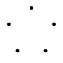

## Hi there 👋

<!--

**Here are some ideas to get you started:**

🙋‍♀️ A short introduction - what is your organization all about?
🌈 Contribution guidelines - how can the community get involved?
👩‍💻 Useful resources - where can the community find your docs? Is there anything else the community should know?
🍿 Fun facts - what does your team eat for breakfast?
🧙 Remember, you can do mighty things with the power of [Markdown](https://docs.github.com/github/writing-on-github/getting-started-with-writing-and-formatting-on-github/basic-writing-and-formatting-syntax)
-->

<section style="display: none">
  <section>
    
 number of page loads sinse 18-12-25 :: 5:56:30 

    
  </section>

  <section>
    

      
      
      
      
      
      
      
      
      
    

  </section>
  
</section>
